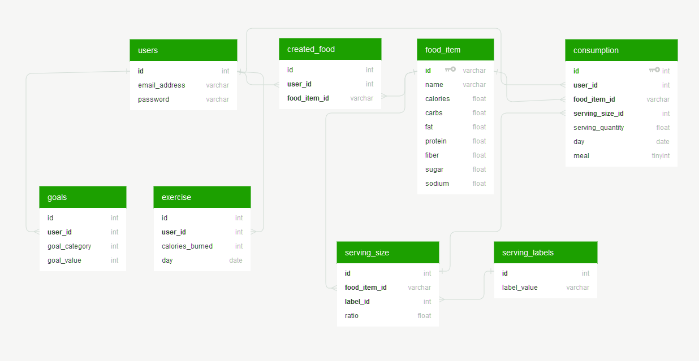

# EasyCal Backend
This is the backend server to the [EasyCal](https://github.com/mileshenrichs/easycal) React.js application: _<http://easycal.io>_

## Technology/Libraries
* __[Play! 1.4.4](https://www.playframework.com/):__ Java MVC web framework (I only really used the M and the C 😉).  Exposes REST API endpoints with JSON responses to communicate application data between the front- and back-end.
* __[MySQL](https://www.mysql.com/):__ model definition and persistence in a relational database
* __[Hibernate ORM](http://hibernate.org/orm/):__ provided object-relational mapping for easy data retreival and manipulation.  Object models mapped using JPA annotations
### Dependencies
* __[JSON-P](https://mvnrepository.com/artifact/javax.json/javax.json-api):__ a JSON utility library, makes building JSON responses a breeze
* __[org.json](https://mvnrepository.com/artifact/org.json/json):__ another JSON util library, super helpful in parsing request bodies composed of JSON
* __[jBCrypt](https://mvnrepository.com/artifact/org.mindrot/jbcrypt/0.3m):__ Java implementation of the BCrypt password hashing algorithm; used to securely save and verify user passwords
* __[Java JWT](https://mvnrepository.com/artifact/io.jsonwebtoken/jjwt):__ API for creation and verification of JSON Web Tokens (see [Authentication](#authentication))

## Data Model
All models reside in `app/models/`.

(shoutout to [Quick Database Diagrams](https://www.quickdatabasediagrams.com/) for this great schema visualization)

* __FoodItem__: the core model of the entire application -- represents a single food
* __Consumption__: records the event of a __User__ (_FK user_id_) adding a __FoodItem__ (_FK food_item_id_) to his/her log for a given meal on a given day
* __ServingSize__: represents a type of serving (i.e. cup, oz, slice). The USDA database standardizes nutrition info in terms of 100 gram servings, so the _ratio_ field indicates the serving size's ratio to this standard.  For example, one cup of shredded cheddar cheese weighs 113 grams, so its ratio is represented as 1.13
* __ServingLabel__: some serving size names will appear very frequently (like cup, oz, slice, and piece), so this serves as a lookup table for just these labels.  At a larger scale, this would prevent excessive duplication of serving label strings in the __ServingSize__ table
* __CreatedFood__: created_food is a join table that relates created __FoodItems__ (_FK food_item_id_) to the __Users__ (_FK user_id_) them
* __Exercise__: describes the amount of calories a __User__ (_FK user_id_) burned on a given day
* __Goals__: each goal is an amount of a nutrient or a calorie value that a user wishes to reach every day.  The goal_category field is an ordinal reference to the `app/models/Goal.GoalCategory` enum whose values consist of: `CALORIES, CARBS, FAT, PROTEIN, FIBER, SUGAR, SODIUM`

All methods that interact with data are located in `app/controllers/EasyCal.java` and `app/util/DatabaseUtil.java`.

## Authentication
Since EasyCal is an application that involves user accounts and individual data, there must be some form of a secure authentication system.  Instead of going with the traditional cookies route, I decided to use [JSON Web Tokens](https://jwt.io/) (JWTs).  The payload of the tokens consists of the following: 

`{userId: xxxx, emailAddress: foo@bar.com, exp: 15284xxxxx}`

This provides all the information needed to identify the user.  Upon registration or login, the `buildJWT(user)` method in `app/controllers/Auth.java` creates a new token using the Java JWT library (see [Dependencies](#dependencies)), which is then persisted in the client's LocalStorage.

To keep routes such as `/`, `/add`, `/stats`, and `/me` protected, the frontend sends a request to `Auth.checkAuth()` to ensure the logged-in user's JWT is valid (the signature matches and the expiration date is not passed).  Furthermore, the Play! framework has a helpful `@Before` annotation to ensure that the user's token is checked prior to _every_ backend request in `EasyCal.checkAuth()`.

If the user's token is absent or invalid, the server responds with a `403 Forbidden` HTTP code, and the frontend clears the user's storage and redirects him/her to `/login`.

## Deployment
This backend server is deployed on an Ubuntu virtual machine through a [Digital Ocean](https://www.digitalocean.com/products/droplets/) droplet.  It only has 1 GB of RAM so if this becomes the next MyFitnessPal, I'm toast. 😅 To get the app online, I build a zipped WAR file, then upload it to the server using [Apache Tomcat](http://tomcat.apache.org/).  I bought a cheap domain (not easycal.io) to enable SSL, so the frontend can communicate with it securely through basic HTTP requests.